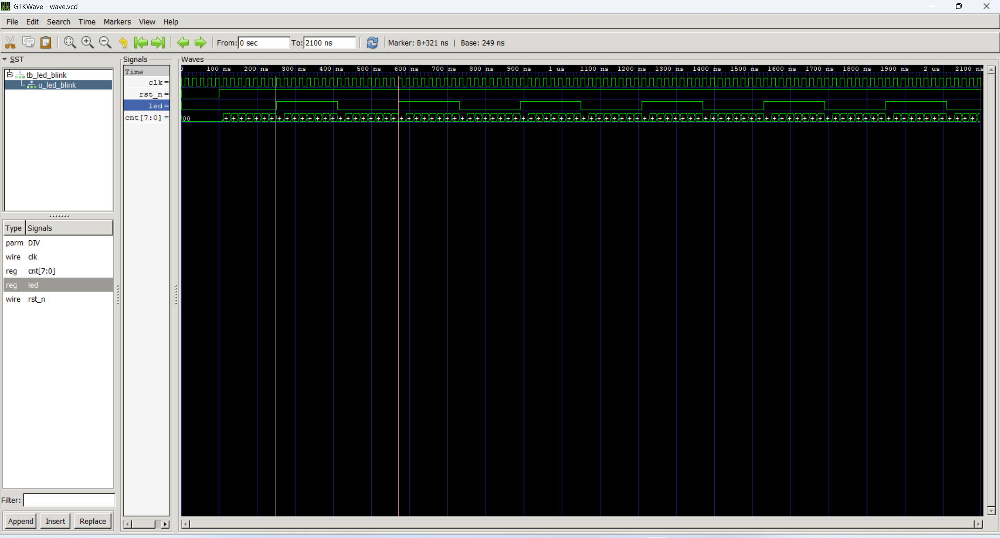

# 笔记 02 —— iverilog + GTKWave 仿真闭环

不打开 Vivado 就能验证逻辑对不对，这是日常开发里用得最多的动作。整套流程几秒钟，
改一行代码就能重跑一次，比 Vivado 综合快两个数量级。

## 一、三步命令

```bat
cd /d D:\fpga-portfolio\projects\01_led_blink

D:\iverilog\bin\iverilog.exe -o sim.vvp src\led_blink.v sim\tb_led_blink.v
D:\iverilog\bin\vvp.exe sim.vvp
start "" "D:\iverilog\gtkwave\bin\gtkwave.exe" wave.vcd
```

- 第一步 **编译**：把 `.v` 源文件编译成 `sim.vvp`（iverilog 的中间格式）。
- 第二步 **运行**：`vvp` 执行仿真，testbench 里的 `$dumpfile` 写出 `wave.vcd`。
- 第三步 **看波形**：`start ""` 是"启动后立刻返回命令行"，不加会阻塞终端。

一键版：目录下已放 `run.bat`，双击或命令行执行 `run.bat` 即可。

## 二、testbench 模板

```verilog
`timescale 1ns / 1ps

module tb_xxx;
    reg  clk;
    reg  rst_n;
    wire out;

    xxx u_xxx (.clk(clk), .rst_n(rst_n), .out(out));

    always #10 clk = ~clk;        // 半周期 10ns -> 50MHz

    initial begin
        $dumpfile("wave.vcd");    // 波形文件名
        $dumpvars(0, tb_xxx);     // 0 = 记录全部层级

        clk = 1'b0; rst_n = 1'b0;
        #100 rst_n = 1'b1;        // 复位 100ns 后释放
        #2000;                    // 跑够时间
        $display("---- sim finished ----");
        $finish;                  // 不写会一直跑下去
    end
endmodule
```

三条铁律：

1. 时钟用 `always #半周期 clk = ~clk`，不要用 `forever`（`always` 更简洁）。
2. **必须有 `$finish`**，否则仿真不会自己停。
3. `$dumpvars(0, 顶层)` 的 `0` 表示递归记录所有层级，波形才能看到子模块内部信号。

## 三、GTKWave 使用要点

打开后窗口是空的，这是正常的，按下面来：

1. 左上 **SST** 面板点开 `tb_xxx` → 再点 `u_xxx`（被例化的模块）；
2. 下方信号列表里**双击** `clk / rst_n / led / cnt` 加进波形区；
3. 点工具栏 **Zoom Fit**（放大镜图标那一排里、带虚线方框的那个）铺满窗口；
   > 窗口上方 `From ... To: ...` 两个输入框是缩放范围，也可以直接填 `0` 和 `2100`。
4. **测量时间间隔 —— 四种方法**：
   - **① 左键横向拖拽（最省事）**：在波形区按住左键横着拖一段再松开，顶部立即显示这段的**时间差**。
     测 `led` 周期：从 `led` 一个上升沿拖到下一个上升沿 → 读数应 ≈ **320ns**。
     （注意：**右键**拖拽是放大，别搞混；左键单击只放点、不显示差值。）
   - **② 主游标（红）+ 基准标记（白）—— 官方推荐的读值方式**：
     - **左键单击** = 放**主游标**（红线），顶部 `Marker:` 显示它的绝对时刻；
     - **中键单击**（把滚轮按下去）= 放**基准标记**（白线），再按一次中键可取消；
     - 基准标记一放好，顶部 `Marker:` 就从绝对时刻变成 **`B±320ns`** 形式 —— 字母 `B` 表示
       "相对基准标记"，**这个数才是真正的时间差**。
   - **③ 精确吸附到跳变沿（测周期最准，本轮实测走的就是这条路）**：
     先在**中间 Signals 面板里单击选中 `led`**（选中后会高亮），再点工具栏的 `<` / `>`（Find Prev / Next Edge），
     主游标就会**自动跳到 led 的下一个跳变沿**，不会手抖点歪。
     本例：第 1 个跳变沿 = **250ns** → 再按两次 `>` 到第 2 个上升沿 = **570ns**，两点差 = **320ns**。
   - **④ 菜单项**：`Markers` 菜单里的 `Toggle Delta-Frequency` 可把右上角差值在"时间 / 频率"之间切换，
     想让工具直接告诉你"多少 MHz"时有用，平时不用管。
     > 之前笔记里写的 `Toggle Measure Marker` 按钮**实际不存在**，已更正。
5. **游标读数为什么会差 1ns（本轮实测踩到）**：`Find Next Edge` 是**精确吸附到跳变沿**的（能落在 250ns 整）；
   而**中键放基准标记是按鼠标所在像素**放的，受缩放级别限制（本例落在 249ns）。
   → 实测 `B+161ns` 里那 1ns 偏差来自基准标记，不是逻辑错了。
   想消掉它：先用**右键拖框**放大到 200~600ns 区间，1 个像素代表的时间变小，读数自然更准。

## 四、本次自检的判读结论

`led_blink` 参数 `DIV = 8`，时钟 20ns：

- 计数 8 个周期 = 160ns 翻转一次 → **led 完整周期 320ns**；
- 复位期间（前 100ns）`cnt`、`led` 均为 0；
- 波形实测与计算一致 → iverilog 全链路打通。



图中可以看到：`clk` 每 20ns 一个周期；`cnt[7:0]` 在 0→7 之间循环（每数满 8 个数 `led` 翻转一次）；
**`led` 的高电平、低电平各持续 160ns，一个完整周期 = 320ns**。

**图顶栏的实测读数**：`Marker: B+321 ns | Base: 249 ns` —— 基准标记（白）放在第 1 个上升沿 249ns，
主游标（红）放在第 2 个上升沿 570ns，差值 **321ns**，与理论值 320ns 一致
（1ns 是鼠标像素落点误差，成因见第三节第 5 条）。

> 注意区分两个数字：**翻转间隔 160ns**（高电平的宽度），**完整周期 320ns**（高 + 低）。
> 这两个数在图上都是一个"台阶宽"的量级，肉眼容易搞混 —— 所以下面用脚本算，不靠读图。

### 实测数据（脚本解析 wave.vcd，比肉眼读图可靠）

| led 变化沿 | 时刻 |
| --- | --- |
| 0 → 1（复位释放后第一次翻转）| 250 ns |
| 1 → 0 | 410 ns |
| 0 → 1 | 570 ns |
| 1 → 0 | 730 ns |
| 1 → 0（最后一次）| 2010 ns |

相邻翻转间隔恒定为 **160 ns**，共 11 个间隔无一例外 → 与 `DIV = 8 × 20ns` 完全吻合。

**怎么自己算出来的**：`tools/vcd_period_check.py`（用 Python 解析 VCD，代替肉眼读波形）

```bat
cd /d D:\fpga-portfolio\projects\01_led_blink
python tools\vcd_period_check.py
```

```
[PASS] 所有间隔均为 160 ns，与 DIV=8 × 20ns 理论值一致
       → led 完整周期 = 320 ns
```

这就是"Python 辅助硬件验证"的最小例子：**仿真工具负责产生数据，Python 负责断言对错**。
以后项目里做 CRC、串口波特率、滤波器响应，都能用同样的套路自动核对，不用每次盯着波形数格子。

> **实操验证**（2026-10-10）：在 Signals 面板选中 `led` 后点 `>`，主游标精确落在 **250ns**，
> 与 `tools/vcd_period_check.py` 解析出的第一个上升沿 250ns 完全一致 —— 说明"选中信号 + Find Next Edge"
> 这条路子可靠。**选信号要在中间 Signals 面板里选，不是在左上 SST 树里点**（SST 里点只是切换层级）。

## 五、常见报错对照表

| 现象 | 原因 | 处理 |
| --- | --- | --- |
| `iverilog -v` 疯狂刷屏 | `-v` 是 verbose，不是 version | 改用 `-V` |
| `gtkwave: can't open wave.vcd` | 命令行当前目录不对 | `cd /d` 到工程目录 |
| 双击 `run.bat` 无任何输出 | 安全软件拦截 bat | 手动敲三条命令 |
| VS Code 改代码不出红线 | linter 只在 open/save 触发 | `Ctrl+S` 保存 |
| Doctor 报 `iverilog not found` | `verilog.linting.path` 填了目录 | 该项留空 |
| 波形一直跑不停 | testbench 少了 `$finish` | 补上 `$finish` |
| `cd D:\xxx` 后提示符还停在 `C:\Users\...>` | **CMD 的 `cd` 只改盘内路径，不换盘符** | `cd /d D:\xxx`（或 `D: && cd \xxx`）|
